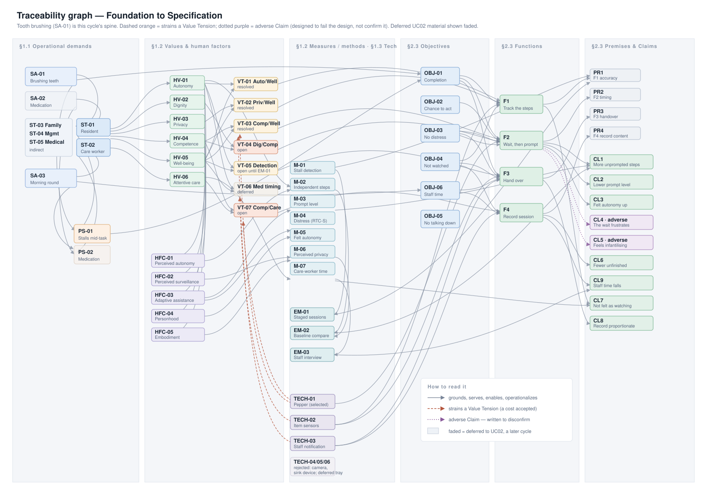

# Foundation and Specification — Overview

*A continuous reading of §1 Foundation and §2 Specification, concatenated from the wiki pages listed in [OUTLINE.md](OUTLINE.md). The field tables of the source pages are rendered here as prose, and the per-page "Graph edges" sections are replaced by the single traceability diagram at the end.*

**A standing caveat, stated once.** This project has collected no primary data. No resident, care worker, family member or manager has been interviewed or observed. Everything below rests on published literature plus the group's own reasoning, and every source page flags itself as provisional. Where the text says what a resident wants or what a care worker needs, read it as a claim the project has not checked against anyone it describes.

---

## 1. Foundation

### 1.1 Operational demands

The project begins with three situated activities: what people in a dementia care home actually do, under the conditions they actually do it in.

**Brushing teeth (SA-01)** is the activity this cycle is built around. Its goal is to maintain oral hygiene as part of the resident's normal morning routine, with as much independence as possible. It is performed by the resident with dementia and supported by a care worker, triggered by the morning routine after waking, washing or breakfast, and runs roughly two to five minutes, twice daily. It decomposes into nine steps: recognising that it is time, going to the sink, locating the toothbrush and toothpaste, picking up the brush, opening the toothpaste, applying it, brushing, rinsing and spitting, and putting things away. The tools are ordinary — toothbrush, toothpaste, sink, cup, mirror, towels, and whatever visual prompts the home already uses. Care staff have worked out their own ways of getting residents through it: reminding them verbally, placing the toothbrush in front of them, putting the toothpaste on for them, demonstrating the brushing action, breaking the activity into spoken instructions, and, at the far end, physically assisting. The breakdowns are equally well-worn: forgetting to start, losing the sequence, not recognising an object, repeating one step over and over, and stopping before the end. The evidence is Rogers et al. (1999) on nursing-home morning care routines and the graduated prompting staff use, Mihailidis et al. (2008) on breaking a comparable stepwise activity into promptable steps, and two studies of everyday-task recall in Alzheimer's.

**Taking prescribed medication (SA-02)** is the second activity, and it is deliberately parked. Its goal is that the right medication is taken at the right time, with the resident understanding what it is for and without repeated reminders. The resident performs it; a care worker prepares the medication and reminds them. Its nine steps run from recognising that it is time through to confirming completion. Existing workarounds include post-it notes, pill organisers, reminder apps, in-person reminders, placing medication somewhere visible, and delegating one employee to the medication round. Its breakdowns include forgetting which medication or that any is due, missing the note, medication running out, a pill organiser refilled wrongly, and an overloaded staff member not checking in on time. This activity is carried by a second use case that has been deferred to a later cycle.

**The morning care round (SA-03)** is the care worker's own activity, and it is what makes the other two expensive. Its goal is to get every resident on the round through their morning care safely and in time, giving each the support they actually need, and to know afterwards what each resident needed so care can continue at handover. It runs from reading the previous shift's handover notes, through going resident to resident waking, washing and dressing, prompting each through personal care such as tooth brushing, handing out and prompting medication, returning to residents who stalled, and finally recording the care given and handing over. One care worker covers several residents in the busiest part of the day, under time pressure and frequent interruption. It breaks down when they have to return repeatedly to the same resident, when they cannot attend to two residents at once so one waits, when step-by-step prompting eats the time Rogers et al. found it eats, and when a resident is checked on too late.

**Five stakeholders** follow from those activities. In the Foundation each is captured by just two things — the values they hold and their relationship to the others — with full behavioural detail deferred to the Personas in §2.2.

The **resident with dementia (ST-01)** is a direct stakeholder, the only one who interacts with the system in real time. They hold dignity, autonomy and well-being highly, competence and privacy moderately. They receive day-to-day support from care workers, may have family involved in care decisions including consent, receive medical care from the GP or nurse, and live in a home run by its management.

The **care home staff member (ST-02)** is also direct, receiving handover requests and reviewing the session record. They hold well-being and attentive care highly; dignity, autonomy, competence and privacy moderately. Their autonomy entry carries a qualification worth keeping: they endorse it for residents but weigh it against the time available. Their privacy entry carries another: they want it for residents, and they want no surveillance of their own work. They support several residents per shift, are employed by management, keep families informed, and coordinate with medical staff.

The remaining three are indirect. **Family members (ST-03)** are affected by outcomes but do not interact with the system and receive none of its records; they hold well-being and dignity highly, and privacy only weakly, since they may want more information about their relative than the resident would choose to share. **Management or owners (ST-04)** decide on adoption without using the system; they hold attentive care and well-being highly, privacy and dignity moderately, and carry the data-protection obligation. **Medical staff (ST-05)** are responsible for care plans and medication, hold well-being highly, and hold privacy as medical confidentiality.

**Two problem scenarios** locate the problem in a concrete moment.

In **PS-01, losing track of the tooth-brushing routine**, it is morning; the resident has finished breakfast and returned to their room. A care worker reminds them it is time to brush their teeth. The resident goes to the bathroom and stands at the sink, where toothbrush and toothpaste are plainly visible. They pick up the toothbrush, pause, seem unsure, and put it back down. The care worker notices and prompts them to pick up the toothpaste. They apply it — and pause again. Another prompt is needed before the activity is finished. The breakdown point is precise: the resident cannot determine their next action independently without verbal prompts. The root causes are difficulty remembering the sequence and difficulty recognising what an object is for; instructions that are too complex and environmental distraction contribute. Three sub-problems fall out — initiation, sequencing and completion — and they structure everything downstream. Four things are explicitly out of scope, each with a reason: medication, which is a separate activity deferred to the second use case; other personal care such as dressing, washing and toileting, which share the sub-problems but involve more intimate exposure, and extending to them is a later decision; physical assistance, which the robot cannot do safely and which stays with the care worker; and dental health assessment, which is a clinical judgement the system should not infer.

In **PS-02, difficulty completing the medication routine**, a care worker explains it is time, and the resident agrees. Medication and water are placed in front of them, but they become distracted by activity elsewhere and, after a while, appear to have forgotten why the tablets are there. Asked what they are for, they need the explanation again, plus reassurance, plus further prompts, before taking them. It adds a fourth sub-problem the tooth-brushing scenario does not have — confirmation, since a resident who does not confirm risks a second dose. Its out-of-scope list is long and consequential: prescribing and dosage, judging whether a medication is appropriate, diagnosis, physically administering medication, and emergency treatment. One nuance inside that list matters later: notifying a care worker when there is an immediate risk of serious harm *during* the activity is in scope by group decision; treating or assessing the emergency is not. Residents on critical medication such as heart medication are blacklisted by the home and require a care worker present; residents on low-stakes medication such as preventive vitamin C are permitted. And general monitoring is excluded — the system reports a failure to complete the task, or immediate risk of harm during it, and nothing else.

### 1.2 Human values and human factors

**Six values** are recorded as first-class grounding nodes, each with a situated meaning, the stakeholders who hold it, whether it is intrinsic or instrumental, and criteria for recognising it served or violated.

**Autonomy (HV-01)** means being able to participate in everyday activities and make one's own choices, rather than having tasks taken over by caregivers or technology: letting the person initiate and perform the steps they can still do, and assisting only where needed. It is intrinsic — having control over one's own activities is valuable in itself — and it instrumentally supports dignity and well-being. It is served when the resident gets meaningful opportunities to choose, initiate and act, and violated when choices are overridden, opportunities withheld, or activities routinely taken over. Its source is self-determination theory (Ryan & Deci, 2000).

**Dignity (HV-02)** means treating people as individuals with their own preferences, abilities and histories rather than reducing them to a diagnosis or a level of dependency: communicating respectfully, involving them in what is happening, avoiding unnecessary exposure or embarrassment, and assisting in a way that preserves self-worth. It is intrinsic, and supports autonomy and well-being. It is violated when a resident is spoken about as though absent, infantilised, embarrassed, exposed, ignored, or treated as a task. Its sources are Value Sensitive Design (Friedman et al., 2008) and Kitwood's (1997) account of personhood in dementia care.

**Privacy (HV-03)** means retaining appropriate control over access to one's body, space, belongings, activities and information, even while needing assistance: observation and caregiver involvement should be no more intrusive than necessary, and sensitive activities handled discreetly. It is primarily intrinsic and supports dignity, autonomy and trust. It is violated when residents are unnecessarily watched, exposed, interrupted or monitored, when personal information reaches people who do not need it, or when technology collects or communicates more than the care activity requires.

**Competence (HV-04)** means enabling residents to experience themselves as still capable of meaningful parts of everyday activities despite cognitive decline — adapting tasks and prompts so they use the abilities they retain instead of having the activity done for them. It is primarily instrumental, serving autonomy, dignity and well-being, though experiencing oneself as capable may have intrinsic value too. It is violated when tasks are made needlessly hard, when the resident repeatedly experiences avoidable failure, or when a person or a machine takes over what they could still do with support.

**Well-being (HV-05)** means supporting emotional and physical comfort and keeping everyday life calm, meaningful and pleasant: reducing avoidable stress, confusion, frustration, discomfort and anxiety, while supporting familiarity, confidence, connection, enjoyment and security. It is intrinsic, held highly by every one of the five stakeholders — the only value that is — and violated when a practice or technology causes avoidable distress that persists or could have been prevented.

**Attentive care (HV-06)** means care staff having enough time and attention to give each resident the support they actually need during the morning round, without being pulled back to the same resident repeatedly or rushing the others. For the care worker it is about doing the job well; for management it is about staffing and quality of care. It is explicitly instrumental — it serves residents' well-being and dignity, because rushed staff take over activities or skip them — and the record draws the consequence out: *because* it is instrumental, it must not be traded against the values it serves. Saving staff time by taking over activities the resident could do would defeat its own purpose. It is served when a care worker can attend to another resident while one finishes, returns less often, and spends less prompting time per resident without completion falling; violated when residents are left waiting, when staff take over to save time, or when the system adds work through frequent low-value alerts.

**Seven value tensions** record where two values cannot both be fully served. Each is written as the trade-off it actually encodes rather than as an absolute bound, and — notably — every one of them records "no non-negotiable floor identified", so that they read as genuine trade-offs rather than as rules smuggled in.

**Autonomy versus well-being (VT-01)** is the basic one: more freedom to act independently supports autonomy, but too little assistance risks mistakes, confusion, frustration or unsafe situations. It is provisionally resolved by a conditional rule — if the resident can continue independently, no assistance; if difficulty is detected, increasingly supportive prompting; if a safety-critical condition arises, a care worker is notified at once, pre-empting any prompting. Immediate assistance on any difficulty was rejected as needlessly reducing autonomy; assistance only on explicit request was rejected because a resident with dementia may not recognise or communicate the need.

**Privacy versus well-being (VT-02)** is the one the technology choices keep running into. The system can only offer timely support if it knows how the activity is going, and the more it senses and records, the better it judges — but every extra sensor and every recorded detail reduces privacy during a personal-care activity in the resident's own bathroom, and cameras in particular make support feel like being watched. It is resolved by monitoring only what is necessary to determine whether support is needed, and not sharing sensitive information unless the agreed conditions for caregiver involvement are met. Constant monitoring of all activities was rejected.

**Competence versus well-being (VT-03)** trades the chance to use remaining abilities against the risk of repeated failure. Time and opportunity support competence; but if the step exceeds current ability, continued attempts produce confusion and distress, while helping earlier protects well-being and removes the chance to demonstrate competence. Resolved with the same shape of conditional rule: allow sufficient time, prompt on repeated difficulty, increase assistance if the resident remains stuck or shows distress. Assisting on mere hesitation was rejected, because hesitation does not indicate inability.

**Dignity versus competence (VT-04)** is sharper, and it stays open. The prompting that lets the resident complete more steps themselves is the same prompting that can feel infantilising — being talked through tooth brushing can be experienced as being treated like a child, least of all acceptably by a machine. Kitwood names infantilisation and outpacing as detractors that erode personhood, and an embodied robot's gaze, timing and tone can enact the same thing. The more explicit and frequent the prompts, the more competence is supported and the greater the dignity risk. The current resolution phrases prompts as offers rather than instructions, addresses the resident by name in an adult register, stops as soon as they resume, frames the robot as a tool rather than a carer, and keeps expressivity low. It is tested by an adverse claim, and strained by the choice of Pepper, whose humanoid form raises the risk.

**Autonomy versus well-being on detection reliability (VT-05)** is the engineering face of the first tension. Stall detection must trade missed stalls against false alarms: a sensitive detector catches more real stalls but interrupts residents who were only pausing; a conservative one leaves stuck residents waiting. This is not merely an annoyance — in the COACH study, mistimed and false-alarm prompts produced frustration and confusion, which is precisely the harm the system exists to prevent. The resolution favours fewer false prompts: the system waits a configured interval, and the lowest prompt level is the least intrusive, so a false detection costs little.

**Autonomy versus well-being on medication timing (VT-06)** trades letting the resident take medication when ready against its being taken on time. This is the one tension with a real floor, and it is inherited rather than chosen: for time-critical medication the home requires a care worker present, so those residents are excluded. It is deferred with the medication use case.

**Competence versus attentive care (VT-07)** is the one that decides whether the project's premise holds. Graduated prompting preserves competence, but Rogers et al. found it took considerably more caregiver time than usual care — so under morning time pressure care workers take over activities residents could still do, which is quicker and costs competence. The resolution is the design's central bet: the system carries the waiting and the lower prompt levels, so the extra time graduated prompting takes is spent by the robot rather than the care worker, who is called only when prompting is exhausted, the resident is distressed, or there is a safety risk. It stays open, tested by a claim that asks whether care-worker time actually falls.

**Five human-factors concepts** supply the mechanisms.

**Perceived autonomy and technology acceptance (HFC-01)** holds that assistive technology preserving a sense of choice and control is more likely to be accepted and kept in use than technology that takes over. Assistance given without an opportunity to act is experienced as controlling, which reduces both the sense of autonomy and the willingness to engage. The caution is explicit: the mechanism is established in older-adult populations generally, and transferring it to people with moderate dementia assumes they can perceive and interpret the choice being offered.

**Perceived surveillance and technology acceptance (HFC-02)** holds that monitoring perceived as continuous, intrusive or unnecessarily detailed reduces the sense of privacy and can produce discomfort, avoidance or rejection. More monitoring gives better information about whether assistance is needed — but once the resident believes more is being collected than necessary, support is experienced as surveillance. The key finding from Niemeijer et al. (2015), who interviewed residents themselves, is that surveillance technology *can* support autonomy, but only when embedded in a person-centred approach. A related concept-mapping study found an inherent duality in professional views rooted in the moral conflict between safety and freedom — which is this project's first two tensions, arrived at independently.

**Adaptive assistance, competence and distress (HFC-03)** holds that assistance should match current ability: too much removes the chance to exercise competence, too little produces repeated failure and distress. Its strongest support is Rogers et al. (1999), where systematic graduated prompting of nursing-home residents with dementia produced a 26% increase in self-dressing, significantly fewer physical assists, and significantly *fewer* disruptive behaviours than usual care, in a severely impaired cohort. The concept carries an unusually honest caveat about direction, which becomes the design's main open question: the concept says assistance should match ability, but not which way to approach the match. The dementia ADL literature largely favours errorless learning with vanishing cues — prompt early to prevent the error, then fade support — whereas this design waits and escalates. The largest trial of errorless learning found structured relearning improved performance and held for six months, but that errorless learning gave no advantage over trial-and-error learning. So neither direction is settled.

**Personhood and malignant social psychology (HFC-04)** holds that how people with dementia are treated in everyday interactions erodes or sustains their sense of being a person. Infantilising them, outpacing them, or treating them as a task erodes personhood even when the help is well-meant and effective. The mechanism is that each interaction carries an implicit message about the person's standing, and the effect comes from tone, pacing and wording — from *how* help is delivered, not only whether it is given — which is exactly how an assistive system can enact it through its prompting style.

**Embodiment and perceived role of assistive robots (HFC-05)** holds that a robot's physical form and behaviour shape the role older adults assign it. A humanoid, expressive robot tends to be read as a supervisor — a "Warden" — while a more mechanical, tool-like robot is read as an aid; and gaze, timing and tone can come across as condescending even when meant to be gentle. People interpret robots as social actors through posture, timing, tone and spatial behaviour, so a human-like body invites human-like role attributions, and oversight by a human-like figure without a relationship is experienced as being watched. Older adults prefer mechanical-looking devices that preserve emotional distance in private contexts such as bathing. Its transfer limits are stated plainly: the interview study behind it covered thirteen cognitively intact older adults ageing in place in a VR home setup, not care-home residents with dementia, and the robotic-bias paper is explicitly conceptual.

**Seven measures** are documented in the Foundation rather than retrofitted later, so that claims can be written testable from the start. Each records what it measures, how, its scoring, its validity, whether it serves verification or validation, and its burden.

*Step-tracking and stall-detection performance (M-01)* is bespoke and quantitative: a staged-event protocol at a mock sink against a timestamped ground-truth log, scoring the proportion of steps correctly identified, stall-detection latency, spurious-prompt rate and handover latency. It needs no human subjects, and its validity rests on the accuracy of the log rather than on prior psychometrics. *Independent step completion (M-02)* is the primary outcome measure, reused directly from COACH: one point per step completed without any prompt or human assistance, summed per session out of nine, compared against the resident's own pre-system baseline. *Prompt level required (M-03)* is a bespoke ordinal coding whose five levels — none, orienting, naming the next action, demonstration, care-worker takeover — correspond to the workarounds SA-01 already records. *Observed distress and resistance (M-04)* uses the Resistiveness to Care Scale, thirteen observed behaviours built specifically for care episodes in advanced dementia, each rated for duration and intensity and multiplied then summed to a score from 0 to 156, with internal consistency of .82 to .87. *Perceived autonomy and felt control (M-05)* uses episode-specific need-fulfilment items from a Dutch nursing-home study, paired with that study's seven-point observer rating of support for autonomy, reported separately and never combined. *Perceived privacy and monitoring acceptability (M-06)* is mixed: post-session resident interviews and care-staff interviews coded into four codes — the system watches, the system records, the system talks down, or neutral-to-positive — plus an inspection of what the stored record actually contains. *Care-worker prompting load (M-07)* is time-sampled observation of prompting episodes, counted and totalled per session against baseline.

Two things run through the measure set and deserve noting. Every observer- or coder-rated measure states a reliability plan: at least 20% of sessions double-coded, agreement reported as kappa or an intraclass correlation, with .60 treated as acceptable. And the self-report measure carries a documented ceiling — in the source study, residents rated their own need fulfilment *higher* than trained observers did, with only weak-to-moderate agreement — so it is never allowed to stand alone.

**Three evaluation methods** apply those measures. *Staged-session verification (EM-01)* performs scripted steps, stalls, resumptions and confounders at a mock sink against the ground-truth log, and inspects stored records; no human subjects, low cost, runnable as soon as a prototype exists, but unable to establish real-world accuracy, since scripted stalls may not resemble real hesitation. *Within-resident baseline comparison (EM-02)* observes residents during the real morning routine, alternating phases without and with the system so each resident is their own baseline, with a short post-session interview asked only if the resident is willing and not distressed; it is expensive, needing care-home access, ethics approval, supported consent and trained observers present during a personal-care activity, and it is limited by small numbers, no control group, novelty effects, and the observer's own presence changing behaviour. *Care-staff interview (EM-03)* asks staff about the handover record and about whether they find the system intrusive for residents or for themselves; it cannot establish the resident's own privacy experience, only how staff read it.

### 1.3 Technology

Six options were considered for the tooth-brushing use case; three are selected, two rejected, one deferred. The rejected options are kept as Foundation knowledge, so the record reads as a selection rather than a justification.

**Pepper (TECH-01), selected,** is the project's robot platform: a humanoid about 1.2 m tall on a wheeled base, with a chest tablet, microphones, speakers, cameras, a depth sensor, touch sensors and LED eyes. What the design uses is narrow — spoken prompts addressing the resident by name, the chest tablet showing a picture or short video of the next step so that demonstration needs no miming, and touch sensors as a non-verbal way to respond. Its limitations are recorded frankly. Its size may not fit a care-home bathroom, so it will probably stand at the doorway, to be checked on site. Its cameras are physically present even when unused, so the resident may still feel watched. Speech recognition of older adults with dementia in a noisy bathroom is likely unreliable, so nothing may depend on understanding what the resident says. And it cannot track the tooth-brushing sequence without its cameras — that is another option's job.

The selection of Pepper is the most interesting entry in the Foundation, because the project's own evidence argues against it. The embodiment concept and the open items it rests on favour a less humanlike, tool-like form for personal care. Choosing Pepper therefore creates a tension, and it is recorded with mitigations and tested by two adverse claims rather than argued away. It strains dignity-versus-competence, since the humanoid form raises the infantilisation risk — mitigated by tool-like framing, low expressivity with no gaze-following and no exaggerated gentleness, adult-register prompts phrased as offers, and demonstration on the tablet rather than by gesture. It strains privacy-versus-well-being, since cameras are present — mitigated by disabling the camera streams in software and visibly covering the lenses, so residents and staff can see they are not in use, and by storing no audio. The rationale is stated plainly: Pepper was chosen over the better-supported alternative because it is the project's platform, "which is why the mitigations above are part of the design and not optional."

**Sensors on the tooth-brushing items (TECH-02), selected,** track the sequence from the items rather than the person: a motion sensor in or clipped to the toothbrush registering pick-up, brushing motion and put-down; a weight pad under cup and toothpaste registering lift and return; a flow sensor on the tap registering rinsing. From these the system infers the current step and detects a stall when no expected change follows within the configured interval. It requires nothing of the resident and observes the activity, not the person — which is how it serves privacy. Its limits are equally clear: it cannot sense steps involving no sensed item, so initiation can only be inferred from the time window running down with no pick-up; it cannot see distress or a collapse, so a possible emergency is inferred from no sensor change and no response to prompts for a configured time; it cannot tell whether teeth were brushed *well*, only that brushing motion occurred; and sensors can be moved, get wet, or be confused by a staff member handling the items. It strains detection reliability — tracking from item events is coarser than video, so some stalls will be missed and some falsely detected — and that cost is accepted deliberately in order to stay within the privacy tension.

**Care-staff notification and session record (TECH-03), selected,** sends a handover request to the care worker's work phone carrying the activity, the step reached and the reason, and stores the three-item session record on a local server. If a request is not acknowledged within a configured time it is re-sent and escalated to a second care worker; if the record cannot be stored, the session is flagged as unrecorded rather than silently lost. Integration with the home's existing nurse-call system is probably not feasible in this project, so the prototype uses a separate app — and a second channel could add to staff workload if it alerts too often.

**Camera-based activity recognition (TECH-04) is rejected.** It would track every step, including those involving no sensed item, and could see distress or a collapse — better detection than the item sensors, which would ease the reliability tension. But it means continuous video of a resident in their bathroom during a personal-care activity. It violates privacy and strains the privacy tension more than anything else considered, and it would make the "not felt as being watched" claim fail by design. It is retained in the record because it is the reason the tracking function works from items instead, and because it would be the first option to revisit if the item sensors prove too unreliable.

**A tool-like sink-side prompting device (TECH-05) is rejected** — but on a project constraint, not on the merits. A small speaker, light and screen mounted by the sink would give the same prompts without a humanoid body. It is the option best supported by the evidence for both dignity and privacy: less risk of being read as a supervisor or of talking down, and it fits inside a bathroom. It is rejected because the project uses Pepper, and it is explicitly retained as the fallback if either adverse claim holds.

**A medication tray or dispenser with sensors (TECH-06) is deferred** with the medication use case.

---

## 2. Specification

### 2.1 Design scenario

The design scenario reimagines the tooth-brushing problem with the system in place, and it is worth reading as the clearest single statement of the design's intent.

It is morning. The care worker, Myra, reminds the resident it is time to brush their teeth, and moves on to the next resident on the round. The resident goes into the bathroom and stands at the sink. Pepper stands quietly just outside the door, camera lenses covered and eye lights dimmed. The resident picks up the toothbrush; the sensor registers the pick-up and the system notes the step. Pepper says nothing.

The resident pauses, toothbrush in hand, unsure what comes next. Pepper waits. After the configured interval nothing has changed, so it gives the lightest prompt, calmly and by name: "Mary, would you like some toothpaste on your brush?" The resident picks up the toothpaste, the weight pad registers the lift, and Pepper goes quiet again.

They apply the toothpaste, then stop again. The orienting prompt was not enough, so after another wait Pepper names the next action — "You could brush your teeth now" — and its chest tablet shows a short, simple picture of someone brushing. The resident starts; the motion registers; Pepper stops prompting at once. When they rinse and put the brush back, Pepper says "All done," once, in an ordinary adult tone — no praise that would suit a child — and nothing more.

Meanwhile Myra has been helping another resident dress. She was not called back, because the resident finished with Pepper's prompts. On her phone the session record shows three things only: completed, highest prompt level "naming", no care worker needed. Nothing about *how* the resident brushed their teeth is stored. And had the resident stopped responding with nothing moving for several minutes, Pepper would have told them someone was coming, and Myra's phone would have received a short message: activity, step reached, reason.

A second design scenario for medication is kept for the deferred use case; the tray-based device it describes corresponds to the deferred technology option, not to the Pepper-based system.

### 2.2 Personas and profiles

Personas are built only for direct stakeholders. Indirect stakeholders carry their role through their relationship to a direct one.

**Mary (HP-01)** elaborates the resident. Hers is the morning routine in question; rather than a passive recipient, she is given time to do each step herself and prompted only on a stall, at the lowest level that gets her going. Her task demands are the three sub-problems made personal: recognising it is time and starting; keeping track of what comes next without the care worker returning each time; and finishing rather than stopping part-way. She can still carry out each step and respond to a short spoken cue, and can say yes or no; she cannot reliably remember the next step once distracted, may not recognise an object, and may repeat a step. She needs calm, short, simple cues, time to act before being prompted, and nothing said to her in a way she would find childish. Her values are the Foundation's, made concrete: she wants the routine to feel within her own control, to be spoken to as a capable adult rather than talked through a basic activity like a child, not to be watched or recorded in her bathroom, to experience that she can still brush her own teeth once reminded, and to have calm mornings without the frustration of getting stuck. Two constraints are stated as positions rather than rules: she will not accept being filmed in her bathroom, and monitoring should go no further than knowing where she is in the routine.

**Myra (HP-02)** elaborates the care worker. Responsible for several residents on the morning round, her role shifts from walking each resident through their routine step by step to being called in only when prompting has run out, the resident is distressed, or there is a safety risk. Her task demands are being able to help another resident while one finishes, receiving a short meaningful message when actually needed, and knowing afterwards what support each resident needed without constant double-checking. She can talk to the resident, reassure, demonstrate and physically help. What she needs from the system is precise and constraining: calls that are rare and meaningful rather than many low-value alerts, and a session record short enough to read on her phone during the round. Her constraints are two refusals: she will not accept a device that collects and stores data in a way that could function as workplace surveillance, and she will not accept a system that cannot flag genuine problems or that sends too many non-critical alerts — because that would defeat the purpose of not having to check on residents constantly.

**Pepper as tooth-brushing aid (RP-01)** is a profile rather than a persona, describing machine capabilities and design intent rather than human-like traits. It stands at the bathroom doorway, stays quiet while the resident manages, prompts at the lowest sufficient level on a stall, and calls the care worker when prompting runs out, the resident is distressed, or there is a safety risk. Its social competencies are defined by restraint: slow, non-interruptive turn-taking, holding silence before prompting, stopping as soon as the resident resumes, responding to a simple yes or no or a touch but never depending on understanding speech, and never initiating conversation beyond the routine. Its embodiment records the mitigations as design facts — positioned at the doorway, never blocking the path, kept away from water, cameras disabled and lenses visibly covered, activity tracking coming from the item sensors rather than the robot, arm and head movement minimal, no gaze-following. Its identity framing is explicit about what it must *not* present as: a helper for the morning routine, a tool, not a carer, companion or supervisor, avoiding anything suggesting it is watching or checking, and avoiding the exaggerated gentleness and praise that would read as treating the resident like a child. It communicates in short spoken sentences, by name, in an ordinary adult register, phrased as offers rather than instructions, escalating from orienting to naming to a picture on the tablet, using soft eye lights rather than alarms or beeping, and telling the resident when a care worker has been called. It processes only item-sensor events and simple responses, keeps no video, stores no audio beyond the moment, retains a three-item record, and shares nothing with family. It adapts when it prompts to the time since the last sensor event, with the wait interval configured per resident — and it deliberately does not build a behavioural profile over time.

### 2.3 Objectives, use cases, functions, premises and claims

**Six objectives** form the bridge from Foundation to Specification, each traceable to a goal, a value or a human-factors concept.

*Activity reaches completion without care-worker prompting carrying it (OBJ-01)* derives from SA-01's own goal and from how PS-01 shows it failing: the resident reaches the last step, and the verbal prompting a care worker currently supplies is no longer what gets them there. It is a Must — it is the goal the activity states and the point at which the problem scenario breaks down.

*A genuine opportunity to act before assistance arrives (OBJ-02)* derives from autonomy and competence: at each step, the resident has had a real chance to act on their own before any assistance arrives. Also a Must, and the record explains why in a sentence that justifies the whole design: without it, completion could be satisfied by a system that simply narrates every step — which is the existing workaround the problem scenario identifies as the problem rather than the solution.

*Difficulty resolved where it appears, before it becomes distress (OBJ-03)* derives from the adaptive-assistance concept: where the resident cannot continue unaided, the difficulty is resolved at the step where it appears rather than accumulating into confusion or distress. It is the other side of the second objective, and the competence-versus-well-being tension is the trade-off between them; a design serving only one has not resolved that tension. It is also flagged as contested on direction, since the same literature favours preventing the error rather than allowing it.

*Support without the feeling of being watched (OBJ-04)* derives from privacy: the resident is supported without experiencing it as being watched, and without detail about a personal-care activity reaching anyone who does not need it. A Should — it constrains how functions may be built rather than adding a capability — but the record notes the constraint is hard, because tooth brushing is personal care.

*Prompting that does not talk down to the resident (OBJ-05)* derives from dignity, and is carefully distinguished from the second objective: that one is about whether the opportunity to act exists, this one about how the prompt reads when it does arrive. A system could serve one and violate the other.

*The care worker's time goes where it is needed, and care continues at handover (OBJ-06)* derives from the morning round's own goal: the care worker is pulled back only when prompting has run out, the resident is distressed, or there is a safety risk, and afterwards knows what support each resident needed. A Should, with a hard condition attached — it must not be met at the expense of the first three objectives, because a system that saves staff time by letting activities go unfinished fails.

**The use case (UC01)** formalises the tooth-brushing activity and its problem scenario. Its nearest published precedent is COACH, which prompted six older adults with moderate-to-severe dementia through handwashing and scored exactly what the independent-step measure scores here.

Its actors are the resident, who is the only one interacting with the system in real time; the care worker, who receives handover and reviews the record but does not operate the system during the activity; the system itself, meaning Pepper plus item sensors plus the notification channel; and family members, who are affected by outcomes but are neither an actor nor a recipient of anything recorded. It triggers when the tooth-brushing window opens and either the resident is at the sink or the window is running down with the activity not started — both, because initiation is the first sub-problem. Its preconditions are that the step sequence and the resident's current assistance baseline are configured, the sensors are fitted and reporting, Pepper is charged and positioned at the doorway within earshot and sight of the sink without blocking the path and with cameras disabled and covered, a care worker is reachable, and consent arrangements are in place. Its postcondition is one of three: the resident has completed the last step, unaided or after prompting; a care worker has taken over; or the window has closed with the activity incomplete and that fact recorded. In every case a session record exists and no step-by-step trace is retained.

The action sequence runs as follows. The window opens and the system begins tracking — a deliberate addition, since the first task is the resident recognising it is time, which the problem scenario shows failing. The resident enters and begins; or, if they have not begun by the end of the window, an initiation prompt is issued, and if there is no response the sequence jumps to handover. The resident performs a step and the system tracks progress. A stall is detected: the system waits the configured interval and does nothing — flagged explicitly as "the wait is the design, not an implementation delay." If the resident resumes unaided, tracking continues. If the stall persists past the interval, the lowest-level prompt available for that step is issued; if they resume, prompting stops. If it persists further, the system re-prompts one level more specific, up to demonstration. At any point, signs of distress skip the remaining prompt levels and go straight to handover. When prompting is exhausted without progress, the system requests care-worker assistance, passing the activity, the step reached and the reason. A safety-critical condition at any point — an immediate risk of serious harm, inferred from no sensor change and no response for a configured time — triggers handover immediately, pre-empting any prompting. Finally the resident completes the last step, or a care worker takes over, or the window closes, and the session is recorded. If the system cannot track the activity at all, it reports a degraded state to the care worker rather than failing silently, and the activity falls back to the existing workarounds.

**Four functions** realise it.

*F1, track position in the activity sequence:* the system determines which step the resident is on, and whether progress has stalled, from their observable actions on the activity's own tools and fixtures — requiring the resident neither to report anything nor to operate the system. It observes the activity only, not the resident in general. Enabled by the item sensors, and deliberately not by Pepper's cameras.

*F2, prompt at the lowest sufficient level, after a wait:* on a detected stall the system waits a configured interval, then issues the least specific prompt that could unblock the step; if the stall persists it re-prompts one level more specific — orienting, then naming the next action, then demonstrating — and stops as soon as the resident resumes. Prompts address the resident by name and in the second person, phrased as an offer rather than an instruction.

Three things are recorded about this function, and together they are the most careful reasoning in the document. Where the ladder comes from: it is not invented but is the escalation the situated activity already records as existing workarounds — verbal reminder, naming, demonstrating — made systematic, with physical assistance deliberately left to the care worker rather than taken on by the system. Where it is contested: it is a least-to-most ladder, while the dementia ADL literature largely runs the other way, and the largest trial of the alternative found no advantage for it, so the evidence neither endorses nor rules out this direction. And what follows: the direction is kept as *a deliberate bet, not an established finding* — the expectation is that wait-then-escalate preserves competence without causing avoidable frustration, one specific adverse claim is designed to settle it, and the fallback is stated in advance. If that claim holds, the function is re-specified, first with a per-resident wait interval, and if that is not enough, as most-to-least with fading.

*F3, hand over to a care worker:* requests assistance when prompting has been exhausted without progress, when the resident shows distress, or when a safety-critical condition occurs, passing only the activity, the step reached and the reason.

*F4, record the session for handover:* records per session whether the activity was completed, the highest prompt level required, and whether a care worker was called — and retains no step-by-step detail.

**Four premises** ask only whether the functions operate as specified; all are verified by staged sessions without human subjects. The tracking premise asks for step-identification accuracy above a threshold and stall detection within a latency bound, plus the requirement that sensor loss or an unrecognised sequence produces a reported degraded state rather than silent failure. The prompting premise asks that the full wait interval elapses before any prompt, that prompting ascends exactly one level at a time and never skips except on the distress path, that it stops within a latency bound of the resident resuming, and that no prompt repeats at the same level more than once — and it notes that the false-prompt rate matters more than it looks, because mistimed prompts were COACH's observed failure mode and are the mechanism by which the adverse claim would come true. The handover premise asks that a request reaches a care worker within a latency bound, carries only the three permitted items, and that the safety-critical path pre-empts pending prompting rather than queueing behind it. The record premise asks that the session record contains exactly the three specified items and no step-level trace, and that records are not readable by roles outside the agreed set — family in particular.

All four latency and accuracy thresholds are still unset. They cannot be derived from the literature for item sensors, and the plan is to run a first staged-session pilot at a mock sink and set each threshold from that pilot and the care worker's needs.

**Nine claims** ask the harder question of whether the functions produce the intended effect. Seven are positive; two are adverse, written to disconfirm the design rather than confirm it.

*CL1* claims the prompting function increases the number of steps the resident completes with no prompt at all, compared with the care worker's current prompt-on-hesitation pattern; it holds if independent step completion rises above the same residents' baseline with no increase in observed distress. *CL2* claims that where the resident does stall, the graduated ladder resolves it at a lower level of assistance than current practice, which moves to naming or demonstrating at once; it holds if the prompt-level distribution shifts lower at equal or better completion. *CL3* claims an increase in the resident's felt sense of doing the activity themselves rather than being led through it — and its criterion is the most carefully written of the set: both parts of the autonomy measure are required, the observer's rating carries the claim, the self-report must merely be no lower than baseline, and *if the two disagree, both are reported and the claim is treated as unresolved*, because resident self-reports have documented ceiling effects.

*CL4, adverse,* claims that for residents whose ability falls below a step's demand, the deliberate wait before prompting increases observed frustration rather than producing independent completion. It tests the competence-versus-well-being tension directly, and its precedent is the same COACH finding the positive claims rely on, running the wrong way. It holds if distress rises above baseline for the lower-ability subgroup while independent completion does not improve for them — and if it holds, the wait interval must become per-resident rather than configured once.

*CL5, adverse,* claims that being prompted through tooth brushing by a robot is experienced as infantilising, independently of whether it improves completion. It holds if residents or care staff describe the prompting as talking down or child-like, or if observed distress rises during prompting. Its criterion carries an important qualification about the technology choice: an expressive humanoid form raises this risk relative to an appliance-like one, so *a negative result on one embodiment does not clear the other* — and the selected embodiment is the higher-risk one, with the tool-like device as the named fallback.

*CL6* claims the handover function reduces the share of sessions ending incomplete, by bringing a care worker in when prompting has run out rather than the activity being abandoned. *CL9* claims it reduces the care worker's prompting time per resident, because the system carries the waiting and the lower prompt levels. This is the claim most at risk, and the record says so: Rogers et al. found graduated prompting took considerably *more* caregiver time than usual care, and absorbing that time is the whole point of the system but remains an empirical question. Its criterion is conjunctive and deliberately so — prompting time must fall *and* completion must be no worse, because "saving time by letting sessions go unfinished does not count."

*CL7* claims the resident does not experience the step tracking as being watched, because it requires nothing of them and observes the activity rather than the person. It holds if no resident expressions of being watched appear in the coding and care staff judge the retained record proportionate. It is sensitive to the technology choice on the same axis as the infantilisation claim: older adults assigned humanoid robots the "Warden" role, oversight without attachment, which is this claim failing by design rather than by accident — and Pepper's cameras, though disabled and covered, are physically present. *CL8* claims the three-item record gives the care worker enough to adjust the support they offer without exposing how the resident performed a personal-care activity step by step.

**A second use case (UC02)** for the medication routine is declared and deliberately deferred, so that the scope decision is explicit rather than implicit in what happened to get written first. It is a separate use case rather than an alternate flow, since the two activities have different triggers and different goals. Three reasons are given for deferring rather than dropping it: its out-of-scope field already narrows it heavily, including the care-home blacklist for critical medication, which needs settling before functions can be written; it adds a fourth sub-problem, confirmation, with no counterpart in tooth brushing, needing its own function and claim and possibly a safety premise; and specifying it properly would roughly double the premise and claim count and require new measures. The four functions are expected to transfer, since both activities are stepwise sequences with initiation, sequencing and completion breakdowns — and confirming that recurrence across two use cases is exactly what would justify abstracting the team and interaction design patterns, so the second use case should be written *before* those are finalised, not after.

### Open items

Twenty-two open items are recorded as explicit decisions rather than left silent. Nineteen are closed, and the closures are substantive rather than bookkeeping — adding the morning round and the attentive-care value, splitting the completion effect from the time effect into two claims, adding the embodiment concept so the infantilisation claim grounds on a concept rather than on claim-level citations, requiring both parts of the autonomy measure, and confirming that no primary data has been collected.

Four remain genuinely open. The premise thresholds have no numbers, and cannot get them from the literature; a mock-sink pilot is proposed. Whether Pepper can physically stand at a care-home bathroom doorway within earshot of the sink without blocking the path needs checking on site or with a mock-up, with the tool-like device as the fallback if it cannot. The care worker's persona requires the system's calls to be "rare and meaningful", but no human-factors concept covers alert fatigue, so the notification channel's alerting policy has nothing to ground on — a candidate sixth concept is named. And one item is resolved only in draft: the Foundation coherence section is written in the repository but needs a wiki page the sync tool cannot create.

Two closed items are worth reading as reasoning rather than record-keeping. The one on prompting direction lays out the contested literature, notes that an author of the review favouring errorless learning is also an author on the trial that failed to confirm it, observes that the trial's participants lived at home rather than in care homes so even the null result transfers cautiously, and then resolves by keeping the direction as a stated bet with a named settling claim and a pre-declared fallback. The one on embodiment asks whether being prompted by a *robot* specifically changes the infantilisation effect, answers that it does, and follows the consequence through to both the technology record and a new human-factors concept — noting that a humanoid form raises the infantilisation risk and the being-watched risk in the same direction, and stating the transfer limits of the evidence for both.

### References

The reference list is itself annotated for confidence, so sources can be checked rather than trusted, with "verified" reserved for citations whose title, authors, journal, year and identifier were all confirmed. Most are verified. Several carry specific warnings: volume and page numbers unconfirmed for three; a book whose detractor list is reported consistently in secondary sources but whose page numbers should be checked before quoting; a journal name that one indexing site gets wrong; a conceptual paper whose authors state their claims "remain largely at a conceptual level" and whose illustrative case is a fictional vignette, to be cited for framing the risk and not as empirical evidence; a paper cited from another's reference list but not yet read; and a group of six secondary citations marked as read only second-hand, with the instruction to retrieve the originals before any of them carries weight.

---

## The traceability graph

Every edge recorded across the Foundation and Specification pages, in one picture. The spine runs left to right: what people do, who is affected, what they value, where those values conflict, what would measure them, what technology is available — then objectives, functions, and the premises and claims that would test them.

Three things are worth tracing by eye. The **tooth-brushing spine** runs unbroken from SA-01 through the resident and the first problem scenario to the completion objective, the four functions and their claims — while the medication material (faded) stops at the tensions and waits for a later cycle. The **orange dashed edges** all converge on the same two tensions from the technology column: choosing Pepper strains both dignity-versus-competence and privacy-versus-well-being, and the item sensors strain detection reliability. These are costs the project accepted with its eyes open, and each is attached to a mitigation and a test. And the **purple dotted edges** both leave the prompting function: the two adverse claims are the design's own attempts to disconfirm itself, one on whether the deliberate wait frustrates residents it was meant to help, the other on whether a robot prompting an adult through tooth brushing is infantilising whatever the completion numbers say.
