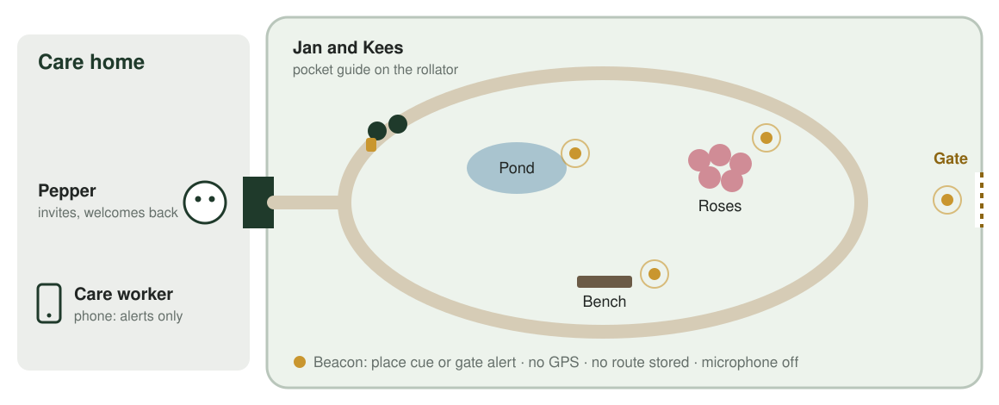
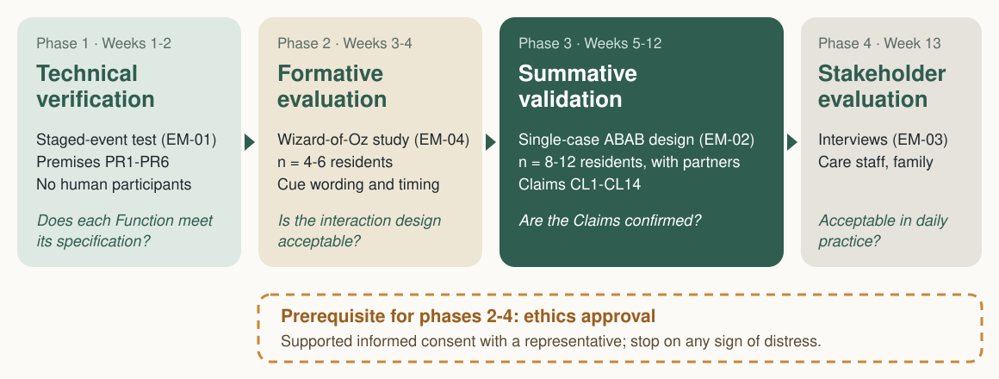
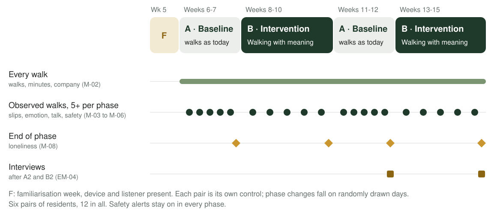
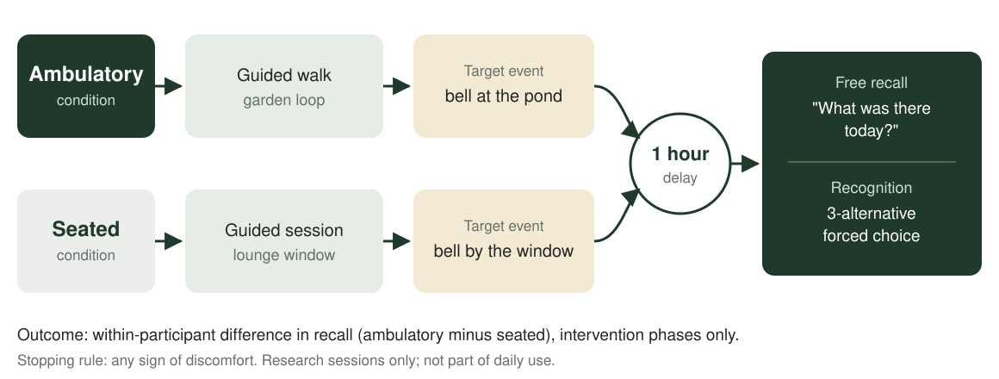

# Mindful Walk

<!-- _class: photo -->
<!-- _paginate: false -->

### From the bathroom sink to the garden path

<!--
- New pitch: from tooth brushing to walks
- Walking, noticing, remembering, listening
-->

## Where we started: tooth brushing

<!-- _class: voice -->

- "Toothpaste next."
- "Now brush the back teeth."
- "Now rinse."

<!--
- Bathroom; two minutes, twice a day
- This is all the robot said: instructions
- No room for theory of mind
- Needs a steady grip; if the hands fail, the concept fails
-->

## Think of your last vacation.

<!-- _class: green -->

### What do you remember?

<!--
- Ask the room; wait twenty seconds
- Two or three people share
- Then, out loud: "Hands up if you were moving: walking, hiking, swimming, cycling"
- Count the hands
-->

## Moving helps memory

<!-- _class: statement -->
<!-- _footer: "Pastor & Bourdin-Kreitz (2024), Scientific Reports 14, 7580" -->

### The same museum tour, walked or seated: the walkers remembered far more of who was where.

<!--
- Link back to the hands
- Walking AR tour against a seated VR tour of the same museum
- Large effect: d = 1.31, 28 adults
- Tested straight after and 48 hours later
-->

## More to talk about

<!-- _class: photo -->

<!--
- Walks bring residents together: partner, volunteer, family
- Every walk differs: season, weather, stories
- Less repetition in the final presentation
-->

## What a walk can serve

<!-- _class: words -->

- Company
- Identity
- Autonomy
- Well-being
- Dignity
- Safety

<!--
- Six Human Values from our Foundation
- Company: a partner with a shared past
- Identity: the old round, the old songs
- Autonomy: whether, where, how long
- Well-being, dignity, safety
-->

## Mindful Walk

<!-- _class: verbs -->

- Walk
- Notice
- Remember
- Rest
- Listen

<!--
- Walk: daily, outdoors, with company
- Notice: feet, air, birdsong
- Remember: the life story along the route
- Rest and listen: rain days, dusk
- Walking comes first
-->

## Jan

<!-- _class: photo -->

### Thirty years on the post round

<!--
- Our persona
- Postal worker: thirty years, on foot and by bike
- Moderate dementia: today is gone, the round is vivid
- Refused a GPS watch: "I'm not a parcel"
- Kees, two doors down, sorted the post at the same depot
-->

## At the rose bed, a prompt plays

<!-- _class: photo -->

### A memory from Jan's own round

<!--
- Pepper at the door: a walk with Kees?
- Pocket guide on the rollator
- Rose bed beacon: a memory prompt plays now, from Jan's life story
- Jan and Kees talk for ten minutes
- Gate: one cue back; Myra gets an alert
- Evening: Jan tells their daughter
-->

## Voice in the pocket, person in reach

<!-- _class: diagram -->

<!--
- Pepper indoors only: no grass, no gravel
- Pocket guide outside, same voice
- Beacons at pond, roses, bench and gate
- No GPS, no route stored; microphone off outdoors
- A person always walks along
-->

## How the voice speaks

<!-- _class: voice -->

- "Feel your feet on the path."
  - Mention what is here, then silence
- A memory, stated from the life story
  - Never "Do you remember?"
- "A walk with Kees, or a sit by the window?"
  - Two options; "no" is fine

<!--
- Three rules
- Adult words, normal pitch
- No praise, no endearments
-->

## Rest, seated or lying

<!-- _class: pair -->

- On rain days, at the window
  - "Rain on the glass."
- At dusk, in bed
  - "Lie back. Feel the pillow under your head."

<!--
- Rain: Pepper at the window
- Breathing light on Pepper's shoulders
- Dusk: guide docked at the bedside
- Concrete cues: nothing to remember
-->

## Listening that fits

<!-- _class: photo -->

### Brass band, football, the morning news

<!--
- Two options from the life story
- News in the morning, calm in the evening
- News always on request, never hidden
- Short stories; a recap for long books
-->

## What could go wrong

<!-- _class: words -->

- Memories that hurt
- A childish voice
- Feeling watched
- Kept from the news

<!--
- Memories can hurt: "I must go home"
- The voice may sound childish
- The robot may feel like being watched
- Calm evenings may feel like censorship
- Each one tested; if true, the design changes
-->

## Evaluation

<!-- _class: green -->

### Verification and validation

<!--
- Verification: do the Functions work as specified (Premises)
- Validation: do they have the intended effect (Claims)
- Four phases, thirteen weeks
-->

## Evaluation plan

<!-- _class: diagram -->

<!--
- Phase 1: technical checks, no residents
- Phase 2: human-operated prototype, tune the voice
- Phase 3: ABAB validation of the Claims
- Phase 4: interviews with staff and family
- Ethics approval before any resident takes part
-->

## Phase 1: technical verification

<!-- _class: table -->

| Test event | Required behaviour | Acceptance criterion (proposed) |
|---|---|---|
| Walker passes the gate beacon | Alert on the care worker's phone | ≤ 10 s, in 19 of 20 trials |
| Pull-cord | Alert; "Someone is coming" | ≤ 10 s, in 20 of 20 trials |
| Device dropped, no response | Two check-ins, then an alert | ≤ 2 min |
| Stop at a bench | Wait, then offer seated practice | after 60-90 s |
| Resident declines an offer | No repeat offer | for ≥ 30 min |
| Session ends | Record contains four items, nothing else | 100% of records |

20 trials per event · no human participants · criteria to be agreed with care staff

<!--
- Staged events against a timestamped reference log
- Premises PR1-PR6
- Numbers are proposals; care workers set the final ones
-->

## Phase 2: human-operated prototype test

<!-- _class: table -->

| Factor | Condition A | Condition B |
|---|---|---|
| Memory cue | Question: "Do you remember your round?" | Statement from the life story |
| Silence between cues | 30 s | 90 s |
| Form of address | First name | No name |

A researcher voices the guide from a script · 4-6 residents · outcomes: observed affect (M-04), engagement (M-05), "talked down" codes (M-08)

<!--
- Formative: before anything is automated
- Each factor varied across short walks and sessions
- The wording residents respond to best goes into the script
-->

## Phase 3: summative validation

<!-- _class: diagram -->

<!--
- Single-case ABAB: baseline, intervention, baseline, intervention
- 8-12 residents, each their own control
- Walk data every walk; observer on sample walks
- Agitation rated by staff at the end of each phase
- Recall task and interview in intervention phases only
-->

## Recall task: ambulatory versus seated encoding

<!-- _class: diagram -->

<!--
- The vacation question, tested on residents (CL3)
- Same target event: a bell, walking or seated
- One hour later: free recall, then a choice of three pictures
- Stop at any sign of discomfort
-->

## Success criteria

<!-- _class: table -->

| Claim | Confirmed if |
|---|---|
| Walking (CL1, CL2) | More walks per week; longer walks; fewer early terminations |
| Recall (CL3) | Ambulatory recall above seated recall, within participants |
| Reminiscence (CL4, CL5) | Higher engagement; no rise in gate alerts or sadness |
| Dignity (CL6) | No "talked down" codes from residents or staff |
| Staffing (CL8) | Fewer staff minutes per walk; human company not reduced |
| Evenings (CL10, CL13) | Lower evening agitation (CMAI) |

<!--
- Each criterion is set before the study starts
- Staffing counts only if human company stays the same
- A null result on recall weakens the walking-first argument; we report it either way
-->

## Next steps

<!-- _class: words -->

- Garden policy
- Evidence check
- Cue script
- Prototype test

<!--
- Garden policy with management
- Evidence pass on the references
- First cue script with one family
- Human-operated prototype test on the garden loop
- Open for questions
-->
