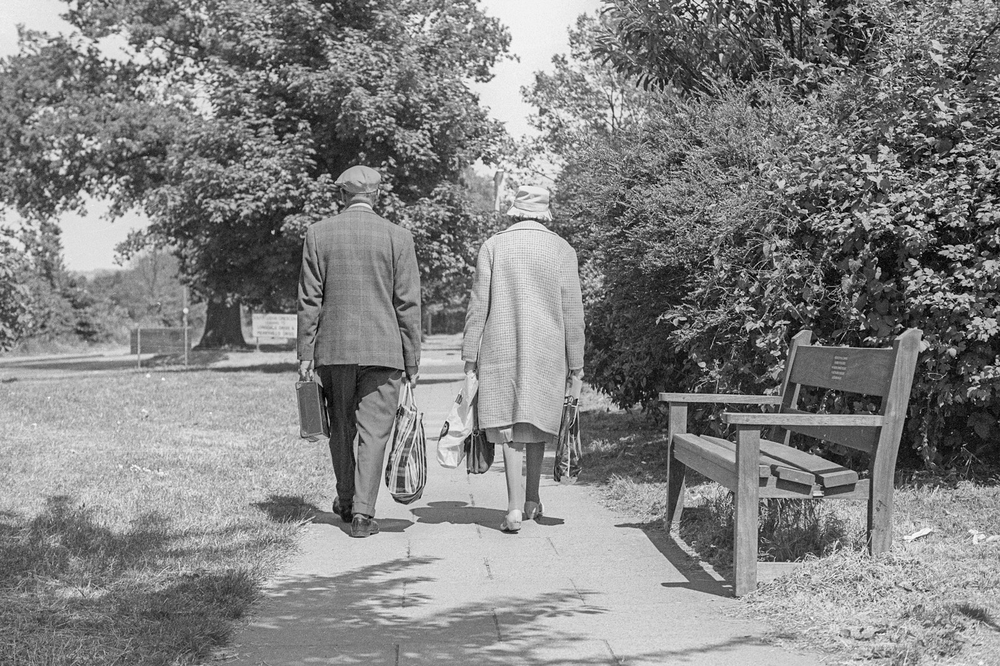
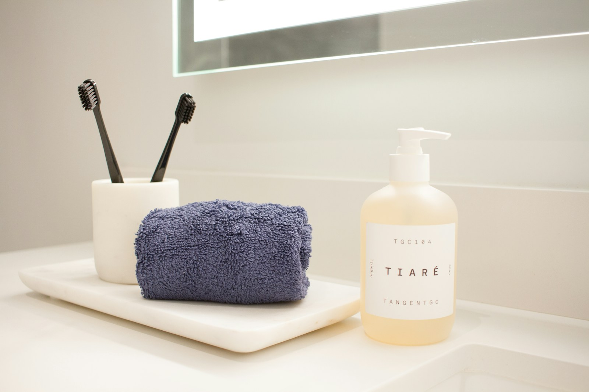
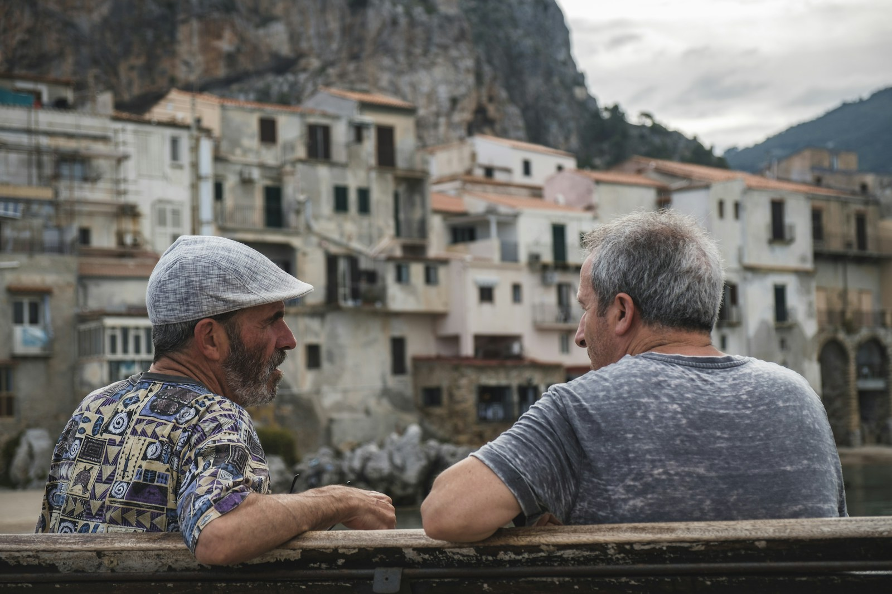
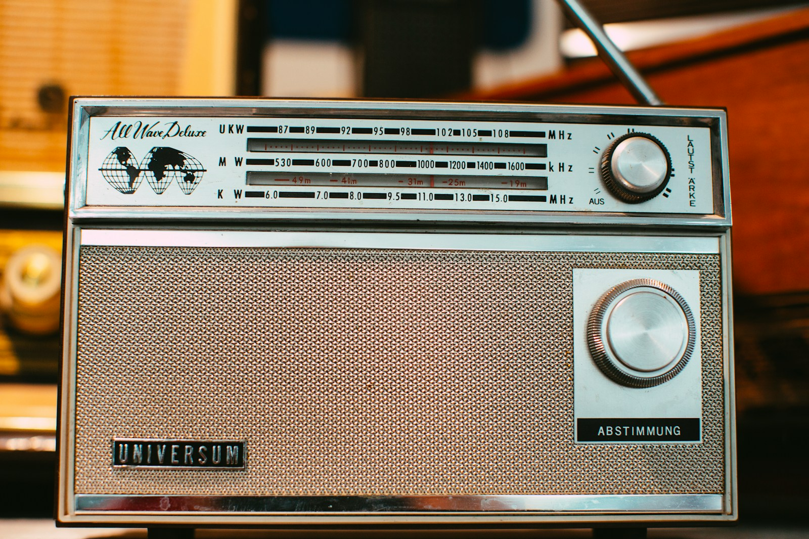
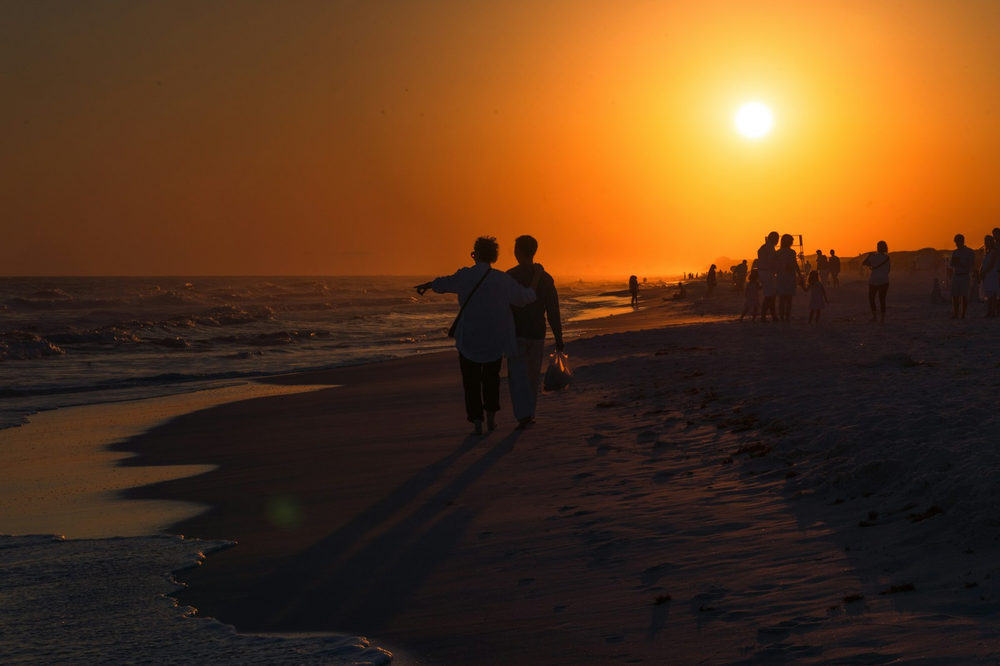

# Mindful Walk

<!-- _class: lead dark -->
<!-- _paginate: false -->

### From the bathroom sink to the garden path

<!--
Our new pitch. Ten seconds, then straight to where we started.
-->

## Where we started: tooth brushing

- Setting: the bathroom, two minutes, twice a day
- What the robot says is instruction: "Toothpaste next." "Now rinse."
- Little room for theory of mind: what the resident thinks, feels or remembers rarely comes up
- Physical limits are hard to address: the task needs a steady grip, and if the hands fail, the concept fails

<!--
Keep it short. The previous concept worked as a prompting system, and that was all it could be.
-->

## Imagine yourself on the last vacation you remember

<!-- _class: dark -->

### What memory comes to mind?

<!--
Ask the room. Give it twenty seconds; let two or three people share their memory out loud.
-->

## Raise your hand if you were moving

Walking through a town, climbing a path, swimming, cycling: hands up.

### We remember experiences on foot better than experiences in a chair

- People who walked a museum tour remembered which face appeared where far better than people who took the same tour seated
- Large effect (d = 1.31); 28 adults; tested straight after and 48 hours later

<!-- _footer: "Pastor & Bourdin-Kreitz (2024). Comparing episodic memory outcomes from walking augmented reality and stationary virtual reality encoding experiences. Scientific Reports, 14, 7580." -->

<!--
Count the hands first, then show the study. Walking AR tour against a seated VR tour of the same museum.
-->

## A walk gives us more to talk about

- Walks bring residents together: a fellow resident, a volunteer, family
- Every walk differs: season, weather, birds, stories
- Less repetition in our final presentation; tooth brushing gets old after one slide
- More of the course in play: memory, attention, identity, company, safety

<!--
The walk is a social activity by nature. Two residents on a bench, talking about the old days: that is the scene we design for.
-->

## Human needs a walk can serve

| Need | On the walk |
|---|---|
| Social connectedness | Company; a partner with a shared past |
| Identity | The harbour, the trade, the old songs |
| Autonomy | Whether, where and how long; "no" is fine |
| Well-being | Exercise, daylight, a calmer evening |
| Dignity | Spoken to as an adult, never quizzed |
| Safety | Help within reach, without tracking |

<!--
All six are Human Values in our Foundation chapter (b1). The walk serves them at once; tooth brushing served two or three.
-->

## Mindful Walk

<!-- _class: dark -->

- Walk daily, outdoors, with company
- Notice the feet, the air, the birdsong
- Remember the harbour, the trade, the old songs
- Rest on a bench, at the rainy window, in bed at dusk
- Listen to radio, news or a story the resident chose

<!--
Five verbs. Walking comes first; the other four support it.
-->

## Meet Jan

- Thirty years at the harbour, the last ten as foreman
- Walked the dog twice a day, until moving in
- Moderate dementia: this morning is gone; the harbour years are vivid
- Refused a GPS watch: "I'm not a parcel."
- Lives two doors from Kees, who crewed the pilot boat at the same harbour

<!--
Jan is our persona (HP-01). Kees is the walking partner (HP-04).
-->

## The harbour walk

1. Pepper at the door: "A walk with Kees, or a sit by the window?"
2. On the path, from the rollator: "Feel your feet on the path."
3. At the pond: "The ropes at the harbour smelled of tar." Ten minutes of harbour stories on the bench.
4. Near the gate, one cue: "The roses are behind you." Myra's phone buzzes; Myra checks from the window.
5. At the door: "The blackbird was singing in the beech." That evening, Jan tells their daughter about it.

<!--
Design Scenario DS-01. Read the quotes in a calm, plain voice: that is how the guide should sound.
-->

## Voice in the pocket, person in reach

- Pepper stays indoors: the invitation at the door, sessions at the window, the welcome back
- A pocket guide goes outside: a speaker on the rollator, one big pause button, a pull-cord for help
- Beacons at the pond, the roses and the gate; no GPS, no route stored
- Microphone off outdoors: the conversation is for the walkers only
- Nobody walks with the voice alone: always a partner, volunteer, relative or care worker

<!--
Pepper cannot cross grass or gravel, so the robot hosts indoors and a small speaker with the same voice goes outside.
-->

## How the voice speaks

| Rule | Sounds like |
|---|---|
| Mention what is here, then stay silent | "Feel your feet on the path." |
| State a memory; never ask for one | "The ropes at the harbour smelled of tar." |
| Offer two things | "A walk with Kees, or a sit by the window?" |

Adult words at normal pitch, without endearments or praise for breathing.

<!--
"Do you remember the harbour?" is a test. "The ropes smelled of tar" is an invitation to talk.
-->

## When it rains, and at dusk

- Rain day: Pepper by the lounge window. "Rain on the glass." Its shoulder lights fade in and out like breathing.
- Dusk: the pocket guide docks at the bedside. "Lie back. Feel the pillow under your head."
- Concrete cues instead of "imagine a beach": nothing to remember, only something to notice
- Rest supports the walk; on most days the walk comes first

<!--
Seated and lying practice, for rain days and for the restless hour before dinner.
-->

## Listening that fits

- Two options, drawn from the life story: "Brass band on the radio, or a short story?"
- Morning: the news. Evening: calm content first.
- News on request at any hour, never hidden
- Short stories over long novels; a one-line recap when a book runs over several days

> "Brass band on Sunday, football on Saturday, the news with my morning coffee." - Jan

<!--
A rule-based recommender. It learns only what was liked or skipped, and keeps no listening log.
-->

## What could go wrong

- Memories can hurt: the harbour can also bring back "I must go home"
- The voice may sound childish
- A robot in the room may feel like being watched
- A calm evening may feel like being kept from the news

Each risk is an adverse claim with its own measure. If one comes true, we change the design.

<!--
Claims CL5, CL6, CL11 and CL14 in the Specification.
-->

## How we find out

1. Wizard-of-Oz: a person voices the guide, so we tune the wording before building anything
2. Staged garden walks: does the guide react on time, every time?
3. With residents, alternating weeks with and without: walk minutes, mood, evening agitation, human company
4. Same-day recall: is the walk remembered better than the chair? Slide 4, tested on our residents.

<!--
Point 4 brings the vacation question back, now with residents.
-->

## Next steps

<!-- _class: dark -->

- Agree the garden policy with management: who may walk with a partner instead of staff
- Check every reference in an evidence pass
- Write a first cue script with one family
- Try it as Wizard-of-Oz on the garden loop

### Questions and ideas welcome
