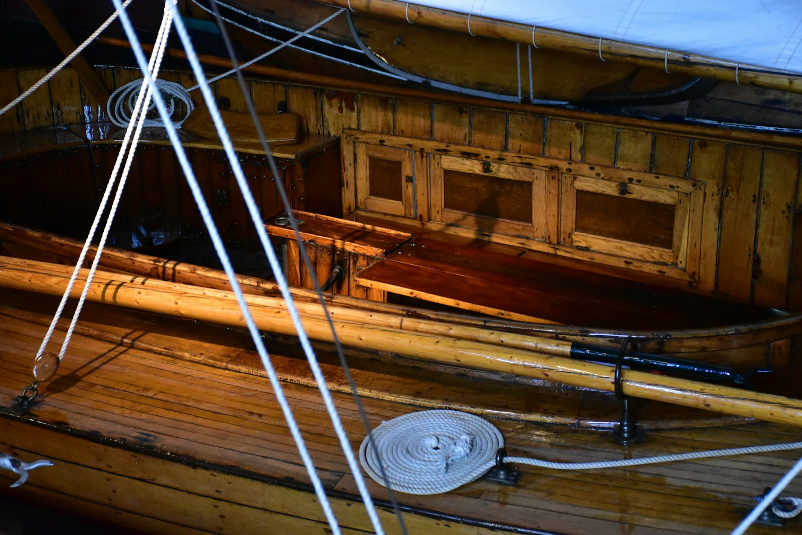
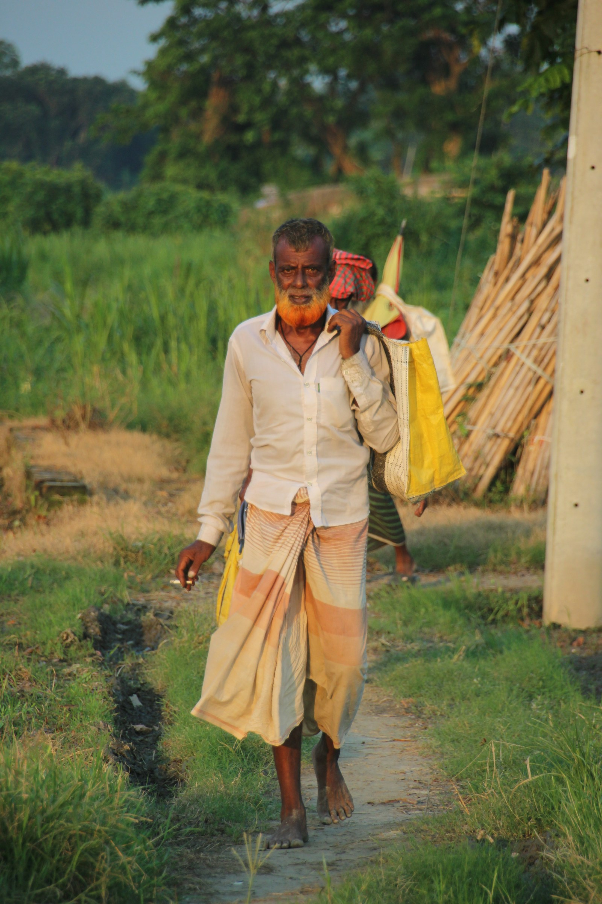
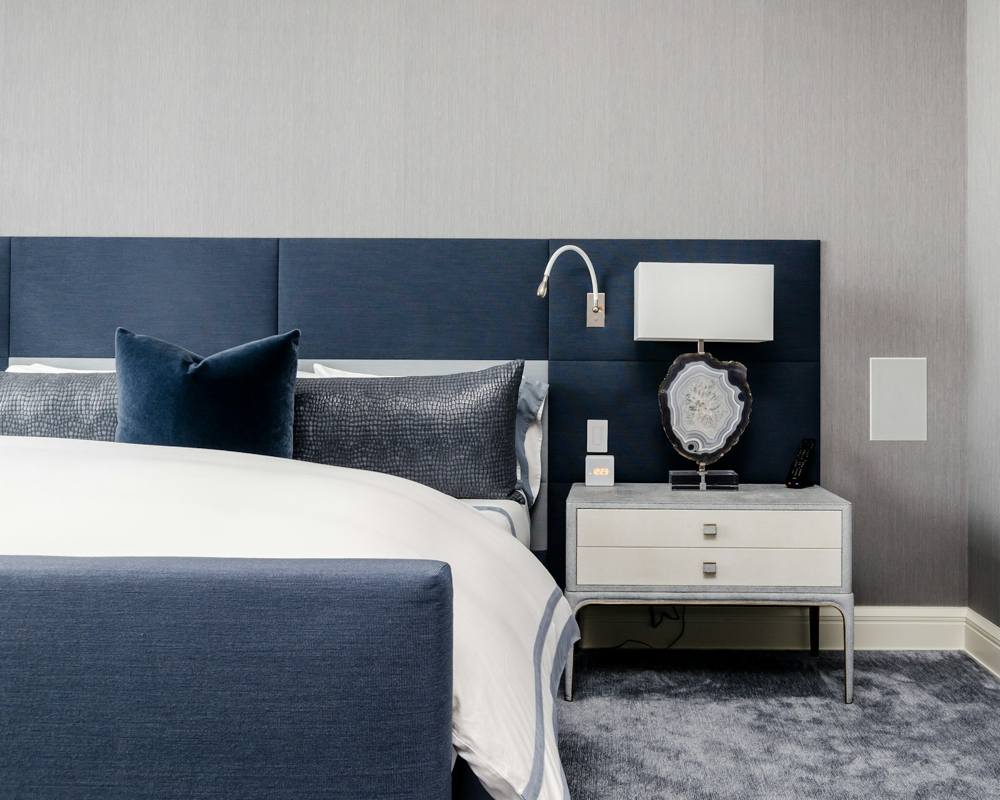
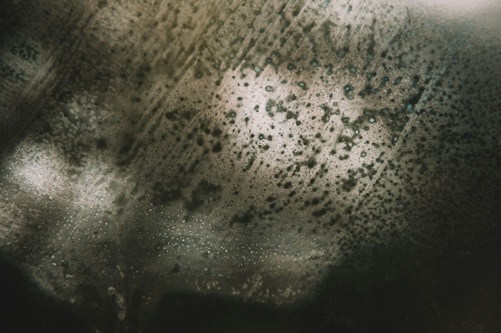

# Mindful Walk

<!-- _class: photo -->
<!-- _paginate: false -->

### From the bathroom sink to the garden path

<!--
Our new pitch. Straight on to where we started.
-->

## Where we started

<!-- _class: photo -->

### Tooth brushing

<!--
- The bathroom: two minutes, twice a day.
- What the robot says is instruction: "Toothpaste next." "Now rinse."
- Little room for theory of mind: what the resident thinks, feels or remembers rarely comes up.
- The task needs a steady grip. If the hands fail, the concept fails.
-->

## Think of your last vacation

<!-- _class: photo -->

### What do you remember?

<!--
Ask the room. Twenty seconds; let two or three people share.
-->

## Hands up if you were moving

<!-- _class: photo -->
<!-- _footer: "Pastor & Bourdin-Kreitz (2024). Comparing episodic memory outcomes from walking augmented reality and stationary virtual reality encoding experiences. Scientific Reports, 14, 7580." -->

<!--
Walking, hiking, swimming, cycling: hands up. Count them.

The study: people who walked a museum tour (AR) remembered which face appeared where far better than people who took the same tour seated (VR). Large effect, d = 1.31; 28 adults; tested straight after and 48 hours later.
-->

## More to talk about

<!-- _class: photo -->

<!--
- Walks bring residents together: a fellow resident, a volunteer, family.
- Every walk differs: season, weather, birds, stories.
- Less repetition in our final presentation. Tooth brushing gets old after one slide.
- More of the course in play: memory, attention, identity, company, safety.
-->

## What a walk can serve

<!-- _class: words -->

- Company
- Identity
- Autonomy
- Well-being
- Dignity
- Safety

<!--
All six are Human Values in our Foundation chapter.
- Company: a partner with a shared past.
- Identity: the harbour, the trade, the old songs.
- Autonomy: whether, where and how long; "no" is fine.
- Well-being: exercise, daylight, a calmer evening.
- Dignity: spoken to as an adult, never quizzed.
- Safety: help within reach, without tracking.
-->

## Mindful Walk

<!-- _class: photo -->

### Walk · Notice · Remember · Rest · Listen

<!--
- Walk daily, outdoors, with company. Walking comes first.
- Notice the feet, the air, the birdsong.
- Remember the harbour, the trade, the old songs.
- Rest on a bench, at the rainy window, in bed at dusk.
- Listen to radio, news or a story the resident chose.
-->

## Jan

<!-- _class: photo -->

### Thirty years at the harbour

<!--
- Foreman for the last ten of those years.
- Walked the dog twice a day, until moving in.
- Moderate dementia: this morning is gone; the harbour years are vivid.
- Refused a GPS watch: "I'm not a parcel."
- Lives two doors from Kees, who crewed the pilot boat at the same harbour.
-->

## "The ropes at the harbour smelled of tar."

<!-- _class: photo -->

<!--
The harbour walk (DS-01):
1. Pepper at the door: "A walk with Kees, or a sit by the window?"
2. On the path, from the rollator: "Feel your feet on the path."
3. At the pond, this line. Jan and Kees talk harbour for ten minutes on the bench.
4. Near the gate, one cue: "The roses are behind you." Myra's phone buzzes; Myra checks from the window.
5. At the door: "The blackbird was singing in the beech." That evening Jan tells their daughter about it.
-->

## Voice in the pocket, person in reach

<!-- _class: photo -->

<!--
- Pepper cannot cross grass or gravel, so it stays indoors: the invitation at the door, sessions at the window, the welcome back.
- A pocket guide with the same voice goes outside: a speaker on the rollator, one big pause button, a pull-cord for help.
- Beacons at the pond, the roses and the gate. No GPS, no route stored.
- Microphone off outdoors: the conversation is for the walkers only.
- Nobody walks with the voice alone: always a partner, volunteer, relative or care worker.
-->

## "Feel your feet on the path."

<!-- _class: split -->

### How the voice speaks

<!--
Three rules:
- Mention what is here, then stay silent.
- State a memory; never ask for one. "Do you remember the harbour?" is a test; "The ropes smelled of tar" invites a story.
- Offer two things: "A walk with Kees, or a sit by the window?"
Adult words at normal pitch, without endearments or praise for breathing.
-->

## When it rains, and at dusk

<!-- _class: photo -->

<!--
- Rain day: Pepper by the lounge window. "Rain on the glass." Its shoulder lights fade in and out like breathing.
- Dusk: the pocket guide docks at the bedside. "Lie back. Feel the pillow under your head."
- Concrete cues instead of "imagine a beach": nothing to remember, only something to notice.
- Rest supports the walk; on most days the walk comes first.
-->

## Listening that fits

<!-- _class: photo -->

### Brass band, football, the morning news

<!--
- Two options, drawn from the life story: "Brass band on the radio, or a short story?"
- Morning: the news. Evening: calm content first.
- News on request at any hour, never hidden.
- Short stories over long novels; a one-line recap when a book runs over several days.
- Rule-based. Learns only what was liked or skipped; keeps no listening log.
-->

## What could go wrong

<!-- _class: photo -->

<!--
Each is an adverse claim with its own measure. If one comes true, we change the design.
- Memories can hurt: the harbour can also bring back "I must go home."
- The voice may sound childish.
- A robot in the room may feel like being watched.
- A calm evening may feel like being kept from the news.
-->

## How we find out

<!-- _class: split -->

<!--
1. Wizard-of-Oz: a person voices the guide, so we tune the wording before building anything.
2. Staged garden walks: does the guide react on time, every time?
3. With residents, alternating weeks with and without: walk minutes, mood, evening agitation, human company.
4. Same-day recall: is the walk remembered better than the chair? The vacation question, tested on our residents.
-->

## Next steps

<!-- _class: photo -->

### Questions and ideas welcome

<!--
- Agree the garden policy with management: who may walk with a partner instead of staff.
- Check every reference in an evidence pass.
- Write a first cue script with one family.
- Try it as Wizard-of-Oz on the garden loop.
-->
