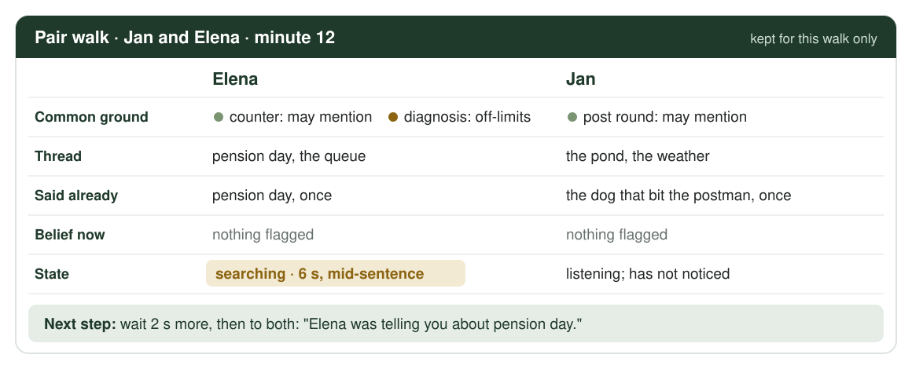
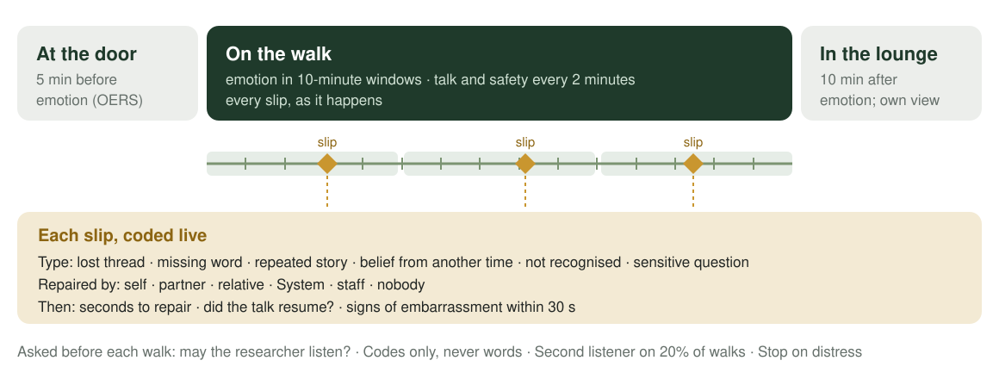

## Original concept: Tooth brushing

<!-- _class: voice -->

- "Toothpaste next."
- "Now brush the back teeth."
- "Now rinse."

<!--
- Bathroom; two minutes, twice a day
- This is all the robot said: instructions
- No room for theory of mind
- Needs a steady grip; if the hands fail, the concept fails
-->

## Think of your last vacation.

<!-- _class: dark -->

### What do you remember?

<!--
- Ask the room; wait twenty seconds
- Two or three people share
- Then, out loud: "Hands up if you were moving: walking, hiking, swimming, cycling"
- Count the hands
-->

## Moving helps memory

<!-- _class: statement -->
<!-- _footer: "Pastor & Bourdin-Kreitz (2024), Scientific Reports 14, 7580" -->

### The same museum tour, walked or seated: the walkers remembered far more of who was where.

<!--
- Link back to the hands
- Walking AR tour against a seated VR tour of the same museum
- Large effect: d = 1.31, 28 adults
- Fresh air and movement also steady emotions
-->

## More to talk about

<!-- _class: photo -->

<!--
- Walks bring residents together
- Side by side, a pause costs less: no face to watch, things to look at
- Less repetition in the final presentation
-->

## What a walk can serve

<!-- _class: words -->

- Company
- Dignity
- Truthfulness
- Privacy
- Identity
- Autonomy
- Well-being
- Safety

<!--
- Eight Human Values from our Foundation
- Company: a chat, a mate, less loneliness
- Dignity: a slip is not remarked on
- Truthfulness: no deception; painful news from a trusted person
- Privacy: no secret passed on; nothing leaves the care home
- Identity: the old trade, the old town
-->

## Walking with meaning

<!-- _class: verbs -->

- Walk
- Talk
- Ask
- Wait
- Redirect

<!--
- Walk: fresh air and movement stimulate memory and steady emotions
- Talk: with a fellow resident, or with the guide where agreed
- Ask: consent before joining someone, and before every conversation starter
- Wait: the speaker gets the first chance to fix a slip
- Redirect: gently, to the place, the thread, or a shared topic
-->

## SA-01 · A walk on your own

<!-- _class: sa -->

| | |
|---|---|
| Who | Resident, alone; staff glance from the window |
| When | Varies widely · 5-30 min · fine weather |
| Goal | Fresh air, movement, a change of scene |
| What breaks down | Nobody to talk to Staff unavailable Confused and attempts to go home |

<!--
- Only residents assessed fit; enclosed garden loop
- Loneliness: some stop going out
- Staff unavailable: the door stays closed, nobody keeps an eye out
- Confused: forgets where or why; heads for the gate to go home
- Addressed by: the guide as company or a bridge to a person; one orienting cue and an alert at the gate
-->

## SA-02 · A walk with a fellow resident

<!-- _class: sa -->

| | |
|---|---|
| Who | Two residents, matched by staff |
| When | Occasional · 15-30 min |
| Goal | Company as the reason to go out |
| What breaks down | Loses the thread; the partner doesn't notice Corrected or quizzed: embarrassed Overexertion: distracted by the partner |

<!--
- Slips: a lost thread, a missing word, a story told twice, a belief from another time
- Both often have dementia: neither notices the other's slips
- Good talk hides tiredness; the walk runs past its set time
- Say aloud: stumbles while talking happen on both walks
- Also: two who dislike each other; "I suppose so", going along to please
- Addressed by: asking each alone; a relationship map; the guide keeps the thread and the time
-->

## Stakeholders

<!-- _class: glance -->

| | | |
|---|---|---|
| ST-01 | Resident with dementia | walks, talks, consents |
| ST-02 | Fellow resident | walking partner |
| ST-03 | Relative | life story, agreed answers |
| ST-04 | Care worker | alerts, painful questions |
| ST-05 | Activity coordinator | pairs, settings, relationship map |
| ST-06 | Medical and therapy staff | fall risk, medical news |
| ST-07 | Care home management | exits, data, local server |

<!--
- Seven stakeholders; two walk, three support, two set limits
- The family agrees what may be said, and by whom
-->

## Problem scenarios

<!-- _class: glance -->

| | | |
|---|---|---|
| PS-01 | A slip nobody noticed | the partner misses it; she withdraws |
| PS-02 | The wrong answer | blunt news; earlier, a kind lie |
| PS-03 | A pairing nobody wanted | "I suppose so"; a quarrel on the loop |
| PS-04 | One more story | talk hides tiredness; a fall |
| PS-05 | A secret passed on | a starter used without consent |
| PS-06 | Nobody to talk to | walks shrink; he stops going out |

<!--
- Four on pair walks, two on walks alone
- In each, something the walk depends on is left to chance: memory, consent, attention, company, trust
- PS-05: a care worker introduces two widows by their grief; it is repeated in front of others
-->

## Human values

<!-- _class: glance -->

| | | |
|---|---|---|
| HV-01 | Autonomy | own reasons, own settings, own consent |
| HV-02 | Dignity | slips not remarked on |
| HV-03 | Privacy | no secret passed on |
| HV-04 | Safety | help arrives quickly |
| HV-05 | Well-being | fresh air, calm |
| HV-06 | Social connectedness | company and conversation |
| HV-07 | Identity | own past, own words |
| HV-08 | Truthfulness | no deception |

<!--
- Social connectedness leads: company is the reason to walk
- Truthfulness: no deception by design; errors corrected; painful truths from a trusted person
-->

## Value tensions

<!-- _class: glance -->

| | | |
|---|---|---|
| VT-01 | Connectedness vs Safety | talk at a stop, not on the move |
| VT-02 | Dignity vs Connectedness | wait first; help both, as a statement |
| VT-03 | Truthfulness vs Well-being | no lies; painful news from a trusted person |
| VT-04 | Privacy vs Connectedness | starters only with consent, per walk |
| VT-05 | Privacy vs Identity | listen on the device; keep nothing said |
| VT-06 | Autonomy vs Safety | gate alert; no lock, no GPS |
| VT-07 | Connectedness vs Autonomy | asked alone; no tallies |

<!--
- Right column: how the design resolves each tension
-->

## Human factors concepts

<!-- _class: glance -->

| | | |
|---|---|---|
| HFC-01 | Fresh air, movement and memory | on foot, remembered better |
| HFC-02 | Walking while talking | attention shared with the path |
| HFC-03 | Conversation repair | the speaker fixes it first |
| HFC-04 | Common ground | old memories, shared |
| HFC-05 | Theory of mind | partners miss each other's slips |
| HFC-06 | Face and personhood | correcting erodes standing |
| HFC-07 | Coping and loneliness | slips lead to withdrawal |
| HFC-08 | Truth and trust | lies found out cost trust |

<!--
- HFC-01 is the vacation question
- HFC-05: theory of mind weakens in dementia; the System keeps a simple model of each walker
-->

## Measures

<!-- _class: glance dense -->

| | | |
|---|---|---|
| M-01 | System performance | staged events, latency |
| M-02 | Walks and company | per week, with whom |
| M-03 | Observed emotion | OERS, rated live |
| M-04 | Slips and recovery | every slip, coded live |
| M-05 | Conversation | talk and its quality |
| M-06 | Safety while talking | stumbles, tiredness |
| M-07 | The walkers' own view | three faces, "Again?" |
| M-08 | Loneliness | 6-item scale, per phase |
| M-09 | Privacy, tone and trust | interview codes |
| M-10 | Sensitive topics, errors | deferrals, corrections |

<!--
- Validated instruments where they exist: OERS, the De Jong Gierveld loneliness scale
- Nothing is recorded: observers code live
-->

## Evaluation methods

<!-- _class: glance -->

| | | |
|---|---|---|
| EM-01 | Prototype | demonstration, staged verification |
| EM-02 | Observed walks | live listening, no recording |
| EM-03 | ABAB per pair | six pairs of residents |
| EM-04 | Interviews | residents, relatives, staff |

<!--
- Detailed in the Evaluation section
-->

## Technology options

<!-- _class: glance -->

| | | |
|---|---|---|
| TECH-01 | Pepper at the door | selected |
| TECH-02 | Pocket guide | selected |
| TECH-03 | Landmark beacons | selected |
| TECH-04 | Local server, a copy per resident | selected |
| TECH-05 | Exchange between copies | selected |
| TECH-06 | Walker model and starters | selected |
| TECH-07 | Cloud speech and language | rejected: data leaves the home |
| TECH-08 | Audio recording | rejected: a store of secrets |
| TECH-09 | GPS, cameras, wristbands | rejected: monitoring |

<!--
- Six selected, three rejected; the rejections are part of the rationale
- No internet connection: nothing leaves the care home
-->

## What we keep from morning care

<!-- _class: kept -->

- Wait before helping
  - The speaker repairs first; then one gentle cue
- A person in reach
  - The System calls; it does not tell
- A minimal record
  - Six items; nothing said, no route
- No cameras
  - Item sensors then, beacons now
- An adult voice
  - Statements, never quizzes; no praise
- A safe fallback
  - If the System fails, walks go on as today

<!--
- New activity, same principles
- Graduated prompting became wait, then redirect gently
- The care-worker handover became the trusted person
- Three-item record then, six items now
- Also kept: staged tests, the within-resident comparison, adverse claims
-->

## Jan

<!-- _class: photo -->

### Thirty years on the post round

<!--
- Our first resident persona
- Postal worker for thirty years, on foot and by bike
- Moderate dementia: today is gone, the round is vivid
- Repeats stories; misses a partner's slip; laughs their own off
- "I'm not a dog to be walked"
-->

## Elena

<!-- _class: photo -->

### Twenty-five years behind the post office counter

<!--
- Our second resident persona
- Mild Alzheimer's disease; notices her own slips, and is embarrassed by them
- Widowed last year; lonely since
- Lives two doors from Jan; both worked for the post in the same town
- "Give me a moment first"
-->

## Thread in the pocket, person in reach

<!-- _class: diagram -->

<!--
- Pepper at the door: asks each walker alone, introduces, welcomes back
- A pocket guide each; a copy of the System per resident, on a local server
- Beacons at the pond, roses, bench and gate
- Listens on the device; no GPS, no route; nothing leaves the home
- The speaker repairs first, the companion second, the System third
-->

## What the guide keeps track of

<!-- _class: diagram -->

<!--
- Theory of mind, kept simple: one model per walker, for one walk
- Common ground: what they share, and what may be mentioned
- The thread, what was said already, a belief from another time, the walker's state
- It decides when to wait, redirect or pass on
- Deleted at the end of the walk
-->

## How the voice speaks

<!-- _class: voice -->

- "Elena was telling you about pension day."
  - Wait first; then redirect gently, to both
- "May I mention the post office counter to Jan?"
  - Ask first, alone; "no" is final
- "That's one for Myra. Shall I ask her to come?"
  - Never deceive; painful truths come from a trusted person

<!--
- Three rules
- Statements, not questions, while walking
- Never "What were you saying?", "You told me", "Do you remember?"
-->

## Talking on the move

<!-- _class: pair -->

- After a stumble
  - "Bench on your left."
- At the set time, even mid-talk
  - "Time to head in. The door is past the roses."

<!--
- Talking takes attention from the path; good talk hides tiredness
- Starters only at a stop; no questions while walking
- A second stumble alerts the care worker
- The physiotherapist sets the walk length; the resident can shorten it
-->

## Is Thomas coming today?

<!-- _class: photo -->

### Painful truths come from a trusted person

<!--
- Elena walks alone; Thomas died last year
- The relationship map lists his death, the trusted person, and the approach agreed with her son
- The guide never lies and never denies: it calls Myra
- Myra comes, sits down, and answers as agreed
-->

## Settings follow the resident

<!-- _class: table -->

| Setting | Options | Set by |
|---|---|---|
| Guide on walks alone | silent · bridge to a person · company | resident, with staff |
| Conversation starters | off · own life · shared with listed partners | resident; each one asked per walk |
| Word help | off · after a wait | resident |
| Form of address | first name · surname · none | resident |
| Walk length | minutes | physiotherapist; the resident can shorten it |

Safety alerts always on · sensitive topics agreed with family and staff

<!--
- The answer to "a dog being walked": the walk serves the resident's own reasons
- Each resident decides how much help, and what may be shared
- Jan: bridge only, no word help. Elena: company on walks alone, word help after a wait
-->

## What could go wrong

<!-- _class: words -->

- Exposing a slip
- Cutting in
- Stumbling mid-talk
- Walked like a dog
- Listened in on
- A secret let slip

<!--
- Help can expose the slip it means to hide
- The guide may cut in before the speaker repairs
- Talking on the move: more stumbles, tiredness missed
- The walk may feel like being walked, for staff's sake
- A listening guide may feel like eavesdropping
- An out-of-date map may let a secret through
- Each one tested; if true, the design changes
-->

## Design scenarios

<!-- _class: glance -->

| | | |
|---|---|---|
| DS-01 | Pension day | Jan and Elena: a lost thread found again |
| DS-02 | Is Thomas coming? | Elena alone; Myra comes |

<!--
- One per walk
-->

## Personas and robot profiles

<!-- _class: glance -->

| | | |
|---|---|---|
| HP-01 | Jan | resident, former postal worker |
| HP-02 | Elena | resident, ran the post office counter |
| HP-03 | Myra | care worker, Elena's trusted person |
| RP-01 | Pepper | at the door |
| RP-02 | Pocket guide | keeps the thread |

<!--
- Three people, two devices, one voice
- Settings per resident
-->

## Objective stories

<!-- _class: glance -->

| | | |
|---|---|---|
| OS-01 | Tell us both | F2 · Dignity, Company |
| OS-02 | Fetch me | F4 · Truthfulness, Well-being |
| OS-03 | Not a dog | F1 · Autonomy, Dignity |

<!--
- Each ties a Function to a value, in a stakeholder's words
- OS-02 is Myra's: "I want the guide to fetch me, not to answer her"
-->

## Objectives

<!-- _class: glance -->

| | | |
|---|---|---|
| OBJ-01 | Talk recovers | Must |
| OBJ-02 | Walk with company | Must |
| OBJ-03 | Safe while talking | Must |
| OBJ-04 | No deception | Must |
| OBJ-05 | No secret revealed | Must |
| OBJ-06 | The resident's own walk | Must |
| OBJ-07 | Adult voice | Should |
| OBJ-08 | Less lonely | Should |

<!--
- Six Musts; talk that recovers comes first
-->

## Use cases and functions

<!-- _class: glance -->

| | | |
|---|---|---|
| UC01 | A walk with a fellow resident | F1-F6 |
| UC02 | A walk on your own | F1-F6 |
| F1 | Ask first | alone, per walk; "no" is final |
| F2 | Keep the thread | wait, then redirect gently |
| F3 | Watch pace and rest | starters only at a stop |
| F4 | Defer sensitive topics | to a trusted person |
| F5 | Call for help | gate, cord, stumble, no response |
| F6 | Keep a short record | six items; nothing said |

<!--
- Two use cases share six functions
- UC01, the pair walk, is the main use case
-->

## Claims

<!-- _class: glance dense -->

| | | |
|---|---|---|
| CL1 | Slips recovered | more, on pair walks |
| CL2 | Help that exposes (adverse) | more embarrassment |
| CL3 | Cutting in (adverse) | less self-repair |
| CL4 | Talking on the move (adverse) | more stumbles |
| CL5 | Asking first | more walks with company |
| CL6 | Painful questions | answered by a trusted person |
| CL7 | Walked like a dog (adverse) | "Again?" falls |
| CL8 | A listening guide (adverse) | felt as eavesdropping |
| CL9 | Loneliness | lower; exploratory |

<!--
- Nine claims, five adverse
- Success criteria in the Evaluation section
-->

## Design patterns

<!-- _class: glance -->

| | | |
|---|---|---|
| TDP-01 | Thread in the pocket, person in reach | speaker first, companion second, System third |
| IDP-01 | Wait, then redirect gently | the place, the thread, a shared topic |
| IDP-02 | Ask first | alone, before; "no" is final |
| IDP-03 | Truthful deferral | never deceive; pass painful truths on |

<!--
- One team pattern, three interaction patterns
-->

## Evaluation

<!-- _class: dark -->

### Verification and validation

<!--
- Verification: do the Functions work as specified (Premises)
- Validation: do they have the intended effect (Claims)
- Four phases, sixteen weeks
-->

## Evaluation plan

<!-- _class: diagram -->

<!--
- Phase 1: prototype and staged checks, no residents
- Phase 2: operator-voiced pilot; tune the wait and the wording
- Phase 3: ABAB validation of the Claims, six pairs
- Phase 4: interviews with residents, relatives and staff
- Ethics approval before any resident takes part
-->

## The prototype: three builds

<!-- _class: table -->

| Build | What it is | Used for |
|---|---|---|
| A · Operator-voiced | A researcher triggers every line from a console | Pilot with residents (Phase 2) |
| B · Automated | Sensing, walker model and alerts on the devices; the operator approves starters | Staged verification (Phase 1) |
| C · Demonstration | Role-players, injected events, the walker model on screen | The demo: one scene per walk |

Phone on the rollator as the pocket guide · five beacons · laptop server with no internet uplink · Pepper at the door

<!--
- Shows every Function end to end
- The screen shows each walker's model live, and why the guide chose each step
- The demo ends by showing what is not kept: no audio file, no traffic outside the home
-->

## Phase 1: staged verification

<!-- _class: table -->

| Test event | Required behaviour | Acceptance criterion (proposed) |
|---|---|---|
| Mid-sentence stop | No System speech during the wait | 8 s, in 20 of 20 trials |
| No resumption after the wait | Thread echoed to both, as a statement | ≤ 3 s, in 19 of 20 trials |
| Starter without this walk's consent | Never used | 0 of 50 trials |
| Question on a listed sensitive topic | Truthful deferral; trusted person alerted | ≤ 10 s; the fact never stated |
| Stumble while talking | Offer to sit; a second stumble alerts staff | ≤ 3 s; ≤ 10 s |
| Full test day | No packet leaves the home; no audio file | 0 |

20 trials per event, 50 for disclosure · no human participants · criteria to be agreed with care staff

<!--
- Staged events against a timestamped reference log
- Premises PR1-PR6
- Numbers are proposals; care workers set the final ones
-->

## Phase 2: operator-voiced pilot

<!-- _class: table -->

| Factor | Condition A | Condition B |
|---|---|---|
| Wait before help | 5 s | 10 s |
| First help after a slip | The place: "The pond's just ahead." | The thread: "Elena was telling you..." |
| Word help | none | after the wait, as a guess to both |

A researcher voices the guide · 4 resident pairs, not in Phase 3 · outcomes: slips recovered (M-04), observed emotion (M-03)

<!--
- Formative: before anything is automated
- Each factor varied across short walks
- What residents respond to best becomes the default
-->

## Phase 3: summative validation

<!-- _class: diagram -->

<!--
- Single-case ABAB: baseline, intervention, baseline, intervention
- Six pairs of residents, 12 in all; each pair is its own control
- Phase changes on randomly drawn days
- At least 5 observed walks per phase
- Safety alerts stay on in every phase
-->

## Observed walks: live listening, no recording

<!-- _class: diagram -->

<!--
- One researcher per walk, about 10 m behind, listening through a headset
- Asked before each walk: may the researcher listen today?
- Emotion rated live (OERS); every slip coded: type, who repaired, how fast, at what cost to face
- Codes only, never words
- Stop at any sign of distress
-->

## Success criteria

<!-- _class: table -->

| Claim | Criterion, set in advance |
|---|---|
| Slips recovered (CL1) | Recovery up at all three phase changes, in 4 of 6 pairs |
| Company (CL5) | More walks with company; more observed pleasure |
| Painful questions (CL6) | All passed to the trusted person; errors corrected |
| Exposing, cutting in (CL2, CL3) | Adverse if face signs rise or self-repair falls |
| Stumbles (CL4) | Adverse if stumbles rise in 2 of 6 pairs |
| Walked, listened in on (CL7, CL8) | Adverse if residents or relatives say so |

<!--
- Each criterion is set before the study starts
- Any disclosure, or an error that causes distress, stops the B phase
- A null result on loneliness is likely; we report it either way
-->

<!-- ## Next steps -->

<!-- _class: words -->
<!-- 
- Relationship map
- Evidence check
- Prototype build
- Ethics approval -->

<!--
- Relationship map and consent forms with care staff
- Evidence pass on the references
- Build A of the prototype on the garden loop
- Ethics approval before any resident takes part
- Open for questions
-->
